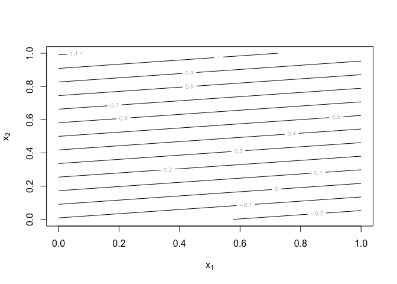
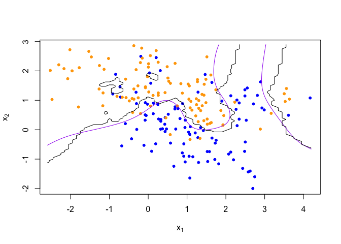
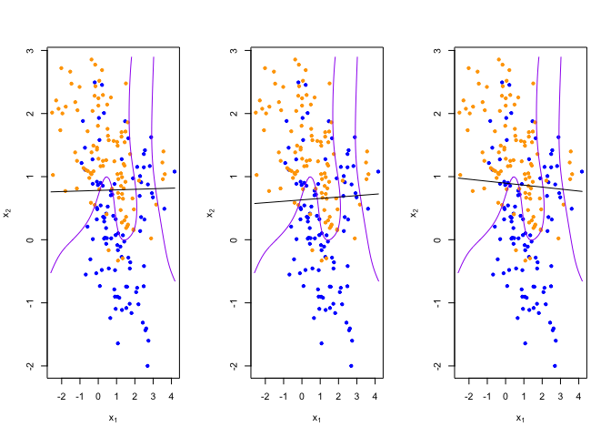
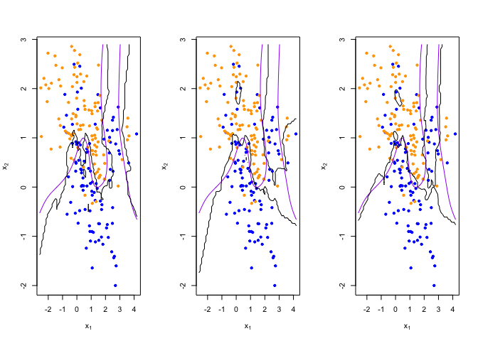
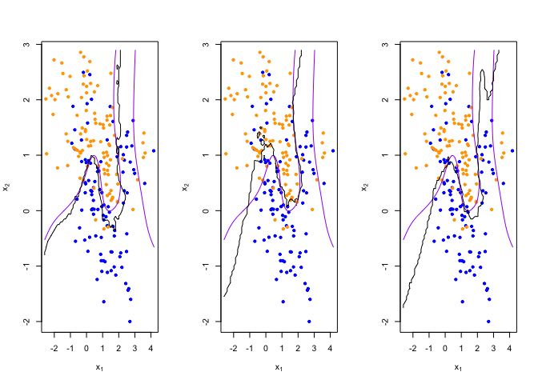

Homework 1
================
Zhan, Zhuoyi
Mon Jan 31 17:06:47 2022

``` r
library('class')
library('dplyr')
```

    ## 
    ## Attaching package: 'dplyr'

    ## The following objects are masked from 'package:stats':
    ## 
    ##     filter, lag

    ## The following objects are masked from 'package:base':
    ## 
    ##     intersect, setdiff, setequal, union

``` r
## load binary classification example data from author website 
## 'ElemStatLearn' package no longer available
load(url('https://web.stanford.edu/~hastie/ElemStatLearn/datasets/ESL.mixture.rda'))
dat <- ESL.mixture

plot_mix_data <- expression({
  plot(dat$x[,1], dat$x[,2],
       col=ifelse(dat$y==0, 'blue', 'orange'),
       pch=20,
       xlab=expression(x[1]),
       ylab=expression(x[2]))
  ## draw Bayes (True) classification boundary
  prob <- matrix(dat$prob, length(dat$px1), length(dat$px2))
  cont <- contourLines(dat$px1, dat$px2, prob, levels=0.5)
  rslt <- sapply(cont, lines, col='purple')
})

eval(plot_mix_data)
```

<!-- -->

``` r
## fit linear classifier
fit_lc <- function(y, x) {
  x <- cbind(1, x)
  beta <- drop(solve(t(x)%*%x)%*%t(x)%*%y)
}

## make predictions from linear classifier
predict_lc <- function(x, beta) {
  cbind(1, x) %*% beta
}

## fit model to mixture data and make predictions
lc_beta <- fit_lc(dat$y, dat$x)
lc_pred <- predict_lc(dat$xnew, lc_beta)

## reshape predictions as a matrix
lc_pred <- matrix(lc_pred, length(dat$px1), length(dat$px2))
contour(lc_pred,
      xlab=expression(x[1]),
      ylab=expression(x[2]))
```

<!-- -->

``` r
## find the contours in 2D space such that lc_pred == 0.5
lc_cont <- contourLines(dat$px1, dat$px2, lc_pred, levels=0.5)

## plot data and decision surface
eval(plot_mix_data)
sapply(lc_cont, lines)
```

<!-- -->

    ## [[1]]
    ## NULL

Homework 1 Using the RMarkdown/knitr/github mechanism, implement the
following tasks by extending the example R script
mixture-data-lin-knn.R: Paste the code from the mixture-data-lin-knn.R
file into the homework template Knitr document. Read the help file for
R’s built-in linear regression function lm Re-write the functions
fit\_lc and predict\_lc using lm, and the associated predict method for
lm objects. Consider making the linear classifier more flexible, by
adding squared terms for x1 and x2 to the linear model Describe how this
more flexible model affects the bias-variance tradeoff

# Question 1

``` r
data <- data.frame(dat$y,dat$x)
beta_lm <- lm(dat.y~., data)
summary(beta_lm)
```

    ## 
    ## Call:
    ## lm(formula = dat.y ~ ., data = data)
    ## 
    ## Residuals:
    ##     Min      1Q  Median      3Q     Max 
    ## -0.9558 -0.3655  0.0318  0.3737  0.7779 
    ## 
    ## Coefficients:
    ##             Estimate Std. Error t value Pr(>|t|)    
    ## (Intercept)  0.32906    0.04783   6.880 7.77e-11 ***
    ## X1          -0.02264    0.02543  -0.890    0.374    
    ## X2           0.24960    0.03215   7.764 4.38e-13 ***
    ## ---
    ## Signif. codes:  0 '***' 0.001 '**' 0.01 '*' 0.05 '.' 0.1 ' ' 1
    ## 
    ## Residual standard error: 0.4248 on 197 degrees of freedom
    ## Multiple R-squared:  0.2892, Adjusted R-squared:  0.282 
    ## F-statistic: 40.07 on 2 and 197 DF,  p-value: 2.504e-15

``` r
#newx <-data.frame(dat$xnew)
```

``` r
newx <-data.frame(dat$xnew)
newx <- rename(newx, X1= x1, X2=x2)
lm_pred <- predict.lm(beta_lm, newx)
## reshape predictions as a matrix
lm_pred <- matrix(lm_pred, length(dat$px1), length(dat$px2))
contour(lm_pred,
      xlab=expression(x[1]),
      ylab=expression(x[2]))
```

<!-- -->

``` r
## find the contours in 2D space such that lc_pred == 0.5
lc_cont <- contourLines(dat$px1, dat$px2, lm_pred, levels=0.5)

## plot data and decision surface
eval(plot_mix_data)
sapply(lc_cont, lines)
```

<!-- -->

    ## [[1]]
    ## NULL

# Question 2

``` r
sq_data <- data.frame(dat$y,dat$x,(dat$x)**2)
sq_beta_lm <- lm(dat.y~., sq_data)
sq_x <-data.frame(dat$xnew,(dat$xnew)**2)
sq_x <- rename(sq_x, X1= x1, X2=x2,X1.1=x1.1, X2.1=x2.1)
sq_pred <- predict.lm(sq_beta_lm, sq_x)
summary(sq_beta_lm)
```

    ## 
    ## Call:
    ## lm(formula = dat.y ~ ., data = sq_data)
    ## 
    ## Residuals:
    ##      Min       1Q   Median       3Q      Max 
    ## -0.90183 -0.37872  0.05262  0.36480  0.78229 
    ## 
    ## Coefficients:
    ##             Estimate Std. Error t value Pr(>|t|)    
    ## (Intercept)  0.33924    0.05216   6.504 6.43e-10 ***
    ## X1          -0.03705    0.03380  -1.096    0.274    
    ## X2           0.26671    0.04247   6.280 2.16e-09 ***
    ## X1.1         0.00734    0.01326   0.554    0.580    
    ## X2.1        -0.01767    0.02339  -0.755    0.451    
    ## ---
    ## Signif. codes:  0 '***' 0.001 '**' 0.01 '*' 0.05 '.' 0.1 ' ' 1
    ## 
    ## Residual standard error: 0.4261 on 195 degrees of freedom
    ## Multiple R-squared:  0.2921, Adjusted R-squared:  0.2775 
    ## F-statistic: 20.11 on 4 and 195 DF,  p-value: 6.985e-14

``` r
sq_pred <- matrix(sq_pred, length(dat$px1), length(dat$px2))
contour(sq_pred,
      xlab=expression(x[1]),
      ylab=expression(x[2]))
```

<!-- -->

``` r
## find the contours in 2D space such that lc_pred == 0.5
lc_cont <- contourLines(dat$px1, dat$px2, sq_pred, levels=0.5)

## plot data and decision surface
eval(plot_mix_data)
sapply(lc_cont, lines)
```

<!-- -->

    ## [[1]]
    ## NULL

# Question 3

Error is the combination of bias and variance. Because we never know the
underlying function, we use fitted function to estimate it. The distance
between the true model and the fitted model is the bias. Variance means
that the fitted models change from one sample to another a lot. By
adding squared terms into the linear regression function, the model gets
more flexible because it becomes curvy and getting closer to the true
decision boundary between two categories. We are reducing testing error
which means the model is fitted better, But when the level of complexity
gets higher and higher, the model will overfit and the test error goes
higher again. So the bias-variance tradeoff means that we need to reach
the optimal level of flexibility, to minimize the test error.

``` r
## fit knn classifier
## use 5-NN to estimate probability of class assignment
knn_fit <- knn(train=dat$x, test=dat$xnew, cl=dat$y, k=5, prob=TRUE)
knn_pred <- attr(knn_fit, 'prob')
knn_pred <- ifelse(knn_fit == 1, knn_pred, 1-knn_pred)

## reshape predictions as a matrix
knn_pred <- matrix(knn_pred, length(dat$px1), length(dat$px2))
contour(knn_pred,
        xlab=expression(x[1]),
        ylab=expression(x[2]),
        levels=c(0.2, 0.5, 0.8))
```

<!-- -->

``` r
## find the contours in 2D space such that knn_pred == 0.5
knn_cont <- contourLines(dat$px1, dat$px2, knn_pred, levels=0.5)

## plot data and decision surface
eval(plot_mix_data)
sapply(knn_cont, lines)
```

<!-- -->

    ## [[1]]
    ## NULL
    ## 
    ## [[2]]
    ## NULL
    ## 
    ## [[3]]
    ## NULL
    ## 
    ## [[4]]
    ## NULL
    ## 
    ## [[5]]
    ## NULL

``` r
## do bootstrap to get a sense of variance in decision surface
resample <- function(dat) {
  idx <- sample(1:length(dat$y), replace = T)
  dat$y <- dat$y[idx]
  dat$x <- dat$x[idx,]
  return(dat)
}
  
## plot linear classifier for three bootstraps
par(mfrow=c(1,3))
for(b in 1:3) {
  datb <- resample(dat)
  ## fit model to mixture data and make predictions
  lc_beta <- fit_lc(datb$y, datb$x)
  lc_pred <- predict_lc(datb$xnew, lc_beta)
  
  ## reshape predictions as a matrix
  lc_pred <- matrix(lc_pred, length(datb$px1), length(datb$px2))

  ## find the contours in 2D space such that lc_pred == 0.5
  lc_cont <- contourLines(datb$px1, datb$px2, lc_pred, levels=0.5)
  
  ## plot data and decision surface
  eval(plot_mix_data)
  sapply(lc_cont, lines)
}
```

<!-- -->

``` r
## plot 5-NN classifier for three bootstraps
par(mfrow=c(1,3))
for(b in 1:3) {
  datb <- resample(dat)
  
  knn_fit <- knn(train=datb$x, test=datb$xnew, cl=datb$y, k=5, prob=TRUE)
  knn_pred <- attr(knn_fit, 'prob')
  knn_pred <- ifelse(knn_fit == 1, knn_pred, 1-knn_pred)
  
  ## reshape predictions as a matrix
  knn_pred <- matrix(knn_pred, length(datb$px1), length(datb$px2))

  ## find the contours in 2D space such that knn_pred == 0.5
  knn_cont <- contourLines(datb$px1, datb$px2, knn_pred, levels=0.5)
  
  ## plot data and decision surface
  eval(plot_mix_data)
  sapply(knn_cont, lines)
}
```

<!-- -->

``` r
## plot 20-NN classifier for three bootstraps
par(mfrow=c(1,3))
for(b in 1:3) {
  datb <- resample(dat)
  
  knn_fit <- knn(train=datb$x, test=datb$xnew, cl=datb$y, k=20, prob=TRUE)
  knn_pred <- attr(knn_fit, 'prob')
  knn_pred <- ifelse(knn_fit == 1, knn_pred, 1-knn_pred)
  
  ## reshape predictions as a matrix
  knn_pred <- matrix(knn_pred, length(datb$px1), length(datb$px2))
  
  ## find the contours in 2D space such that knn_pred == 0.5
  knn_cont <- contourLines(datb$px1, datb$px2, knn_pred, levels=0.5)
  
  ## plot data and decision surface
  eval(plot_mix_data)
  sapply(knn_cont, lines)
}
```

<!-- -->
