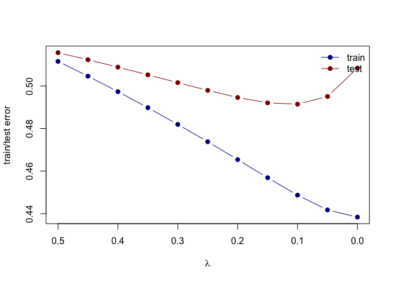

Homework 3
================
Zhan, Zhuoyi
Tue Feb 15 15:21:37 2022

### Use the prostate cancer data. Use the cor function to reproduce the correlations

``` r
## load prostate data
prostate <- 
  read.table(url(
    'https://web.stanford.edu/~hastie/ElemStatLearn/datasets/prostate.data'))

cor(prostate[,1:8], use= "pairwise.complete.obs")
```

    ##            lcavol    lweight       age         lbph         svi          lcp
    ## lcavol  1.0000000 0.28052138 0.2249999  0.027349703  0.53884500  0.675310484
    ## lweight 0.2805214 1.00000000 0.3479691  0.442264399  0.15538490  0.164537142
    ## age     0.2249999 0.34796911 1.0000000  0.350185896  0.11765804  0.127667752
    ## lbph    0.0273497 0.44226440 0.3501859  1.000000000 -0.08584324 -0.006999431
    ## svi     0.5388450 0.15538490 0.1176580 -0.085843238  1.00000000  0.673111185
    ## lcp     0.6753105 0.16453714 0.1276678 -0.006999431  0.67311118  1.000000000
    ## gleason 0.4324171 0.05688209 0.2688916  0.077820447  0.32041222  0.514830063
    ## pgg45   0.4336522 0.10735379 0.2761124  0.078460018  0.45764762  0.631528246
    ##            gleason      pgg45
    ## lcavol  0.43241706 0.43365225
    ## lweight 0.05688209 0.10735379
    ## age     0.26889160 0.27611245
    ## lbph    0.07782045 0.07846002
    ## svi     0.32041222 0.45764762
    ## lcp     0.51483006 0.63152825
    ## gleason 1.00000000 0.75190451
    ## pgg45   0.75190451 1.00000000

``` r
#prostate_train <- subset(prostate, train==TRUE) %>% select(-'train')
#test <- subset(prostate, train==FALSE) %>% select(-'train')
```

### Treat lcavol as the outcome, and use all other variables in the data set as predictors.

``` r
library(tidyverse)
```

    ## ── Attaching packages ─────────────────────────────────────── tidyverse 1.3.1 ──

    ## ✓ ggplot2 3.3.5     ✓ purrr   0.3.4
    ## ✓ tibble  3.1.6     ✓ dplyr   1.0.7
    ## ✓ tidyr   1.1.4     ✓ stringr 1.4.0
    ## ✓ readr   2.0.1     ✓ forcats 0.5.1

    ## ── Conflicts ────────────────────────────────────────── tidyverse_conflicts() ──
    ## x dplyr::filter() masks stats::filter()
    ## x dplyr::lag()    masks stats::lag()

``` r
library('splines')        ## for 'bs'
library('dplyr')  
library('magrittr')
```

    ## 
    ## Attaching package: 'magrittr'

    ## The following object is masked from 'package:purrr':
    ## 
    ##     set_names

    ## The following object is masked from 'package:tidyr':
    ## 
    ##     extract

``` r
library(glmnet)    
```

    ## Loading required package: Matrix

    ## 
    ## Attaching package: 'Matrix'

    ## The following objects are masked from 'package:tidyr':
    ## 
    ##     expand, pack, unpack

    ## Loaded glmnet 4.1-3

``` r
proTrain <- filter(prostate, train)
proTest <- filter(prostate, !train)
proTrain <-select(proTrain, -train)
proTest <-select(proTest, -train)
```

### With the training subset of the prostate data, train a least-squares regression model with all predictors using the lm function.

``` r
fit <- lm(lcavol ~ ., 
             data=proTrain)
summary(fit)
```

    ## 
    ## Call:
    ## lm(formula = lcavol ~ ., data = proTrain)
    ## 
    ## Residuals:
    ##      Min       1Q   Median       3Q      Max 
    ## -1.71027 -0.50138  0.03103  0.51352  1.35376 
    ## 
    ## Coefficients:
    ##              Estimate Std. Error t value Pr(>|t|)    
    ## (Intercept) -2.173357   1.526699  -1.424    0.160    
    ## lweight     -0.113370   0.236639  -0.479    0.634    
    ## age          0.020102   0.013571   1.481    0.144    
    ## lbph        -0.056981   0.072525  -0.786    0.435    
    ## svi          0.035116   0.313526   0.112    0.911    
    ## lcp          0.418455   0.099521   4.205 9.16e-05 ***
    ## gleason      0.224387   0.198812   1.129    0.264    
    ## pgg45       -0.009113   0.005451  -1.672    0.100 .  
    ## lpsa         0.575455   0.107235   5.366 1.47e-06 ***
    ## ---
    ## Signif. codes:  0 '***' 0.001 '**' 0.01 '*' 0.05 '.' 0.1 ' ' 1
    ## 
    ## Residual standard error: 0.7116 on 58 degrees of freedom
    ## Multiple R-squared:  0.7118, Adjusted R-squared:  0.672 
    ## F-statistic:  17.9 on 8 and 58 DF,  p-value: 3.999e-13

``` r
#prostate.lm <- lm(lpsa ~ ., data=prostate_train)
#summary(prostate.lm)
```

### Use the testing subset to compute the test error (average squared-error loss) using the fitted least-squares regression model.

``` r
predictions <- predict(fit, newdata=proTest)
((predictions  -  proTest$lcavol)^2 %>% sum)/ length(predictions) 
```

    ## [1] 0.5084068

\#\#\#Train a ridge regression model using the glmnet function, and tune
the value of lambda (i.e., use guess and check to find the value of
lambda that approximately minimizes the test error).

``` r
L2_loss <- function(y, yhat)
  (y-yhat)^2
error <- function(dat, fit, loss=L2_loss)
  mean(loss(dat$lcavol, predict(fit, newdata=dat)))

x_inp <- model.matrix(lcavol ~  lweight + age + lbph + lcp + pgg45 + lpsa + svi + gleason, data=proTrain)
y_out <- proTrain$lcavol
fit <- glmnet(x=x_inp, y=y_out, alpha=0, lambda=seq(0.5, 0, -0.05))
print(fit$beta)
```

    ## 9 x 11 sparse Matrix of class "dgCMatrix"

    ##    [[ suppressing 11 column names 's0', 's1', 's2' ... ]]

    ##                                                                    
    ## (Intercept)  .             .             .             .           
    ## lweight      0.0993164708  9.167566e-02  0.0826683948  0.0719539791
    ## age          0.0129153943  1.324527e-02  0.0136179441  0.0140406458
    ## lbph        -0.0145798645 -1.634009e-02 -0.0183250211 -0.0206075810
    ## lcp          0.2406189663  2.481045e-01  0.2566365965  0.2662889674
    ## pgg45        0.0002559092 -6.282802e-05 -0.0004352183 -0.0008738898
    ## lpsa         0.3427088262  3.542773e-01  0.3670625828  0.3813402190
    ## svi          0.3767521726  3.693591e-01  0.3595330020  0.3468674180
    ## gleason      0.1379543516  1.394770e-01  0.1413173561  0.1436779615
    ##                                                                             
    ## (Intercept)  .            .            .            .            .          
    ## lweight      0.059127616  0.043652593  0.024777969  0.001504802 -0.027603986
    ## age          0.014526957  0.015088490  0.015748487  0.016532948  0.017480107
    ## lbph        -0.023258103 -0.026377963 -0.030098852 -0.034621150 -0.040241264
    ## lcp          0.277447149  0.290342311  0.305728439  0.324372008  0.347616547
    ## pgg45       -0.001398912 -0.002031353 -0.002810371 -0.003788173 -0.005050263
    ## lpsa         0.397429712  0.415786556  0.437009864  0.461951799  0.491849702
    ## svi          0.330415198  0.309283880  0.281608260  0.245177911  0.196427346
    ## gleason      0.146778188  0.150949425  0.156678907  0.164800413  0.176722769
    ##                                      
    ## (Intercept)  .            .          
    ## lweight     -0.064680201 -0.113137304
    ## age          0.018643148  0.020098181
    ## lbph        -0.047425776 -0.056962692
    ## lcp          0.377657417  0.418431830
    ## pgg45       -0.006739814 -0.009116838
    ## lpsa         0.528596455  0.575318051
    ## svi          0.129711598  0.035342349
    ## gleason      0.194999807  0.224585243

``` r
form  <- lcavol ~  lweight + age + lbph + lcp + pgg45 + lpsa + svi + gleason
error <- function(dat, fit, lam, form, loss=L2_loss) {
  x_inp <- model.matrix(form, data=dat)
  y_out <- dat$lcavol
  y_hat <- predict(fit, newx=x_inp, s=lam)  ## see predict.elnet
  mean(loss(y_out, y_hat))
}
```

``` r
library(dplyr)
library(tidyverse)
min_error <- Inf
count <- 0
for (lam in seq(0,1,0.01)){
  err <-  error(proTest, fit, lam, form=form)
  count <- count + 1
  if (err < min_error){
    min_error = err
    cur_lambda = lam
  }
}
(cur_lambda)
```

    ## [1] 0.12

``` r
#error(proTest, fit, lam=0, form=form)
#error(proTest, fit, lam=0.03, form=form)
#error(proTest, fit, lam=0.05, form=form)
#error(proTest, fit, lam=0.1, form=form)
#error(proTest, fit, lam=0.12, form=form)
```

### Create a figure that shows the training and test error associated with ridge regression as a function of lambda. Create a path diagram of the ridge regression analysis, similar to HTF Figure 3.8

``` r
err_train_1 <- sapply(fit$lambda, function(lam) 
  error(proTrain, fit, lam, form))
err_test_1 <- sapply(fit$lambda, function(lam) 
  error(proTest, fit, lam, form))
```

``` r
plot(x=range(fit$lambda),
     y=range(c(err_train_1, err_test_1)),
     xlim=rev(range(fit$lambda)),
     type='n',
     xlab=expression(lambda),
     ylab='train/test error')
points(fit$lambda, err_train_1, pch=19, type='b', col='darkblue')
points(fit$lambda, err_test_1, pch=19, type='b', col='darkred')
legend('topright', c('train','test'), lty=1, pch=19,
       col=c('darkblue','darkred'), bty='n')
```

<!-- -->

``` r
colnames(fit$beta) <- paste('lam =', fit$lambda)
print(fit$beta %>% as.matrix)
```

    ##                 lam = 0.5    lam = 0.45     lam = 0.4    lam = 0.35
    ## (Intercept)  0.0000000000  0.000000e+00  0.0000000000  0.0000000000
    ## lweight      0.0993164708  9.167566e-02  0.0826683948  0.0719539791
    ## age          0.0129153943  1.324527e-02  0.0136179441  0.0140406458
    ## lbph        -0.0145798645 -1.634009e-02 -0.0183250211 -0.0206075810
    ## lcp          0.2406189663  2.481045e-01  0.2566365965  0.2662889674
    ## pgg45        0.0002559092 -6.282802e-05 -0.0004352183 -0.0008738898
    ## lpsa         0.3427088262  3.542773e-01  0.3670625828  0.3813402190
    ## svi          0.3767521726  3.693591e-01  0.3595330020  0.3468674180
    ## gleason      0.1379543516  1.394770e-01  0.1413173561  0.1436779615
    ##                lam = 0.3   lam = 0.25    lam = 0.2   lam = 0.15    lam = 0.1
    ## (Intercept)  0.000000000  0.000000000  0.000000000  0.000000000  0.000000000
    ## lweight      0.059127616  0.043652593  0.024777969  0.001504802 -0.027603986
    ## age          0.014526957  0.015088490  0.015748487  0.016532948  0.017480107
    ## lbph        -0.023258103 -0.026377963 -0.030098852 -0.034621150 -0.040241264
    ## lcp          0.277447149  0.290342311  0.305728439  0.324372008  0.347616547
    ## pgg45       -0.001398912 -0.002031353 -0.002810371 -0.003788173 -0.005050263
    ## lpsa         0.397429712  0.415786556  0.437009864  0.461951799  0.491849702
    ## svi          0.330415198  0.309283880  0.281608260  0.245177911  0.196427346
    ## gleason      0.146778188  0.150949425  0.156678907  0.164800413  0.176722769
    ##               lam = 0.05      lam = 0
    ## (Intercept)  0.000000000  0.000000000
    ## lweight     -0.064680201 -0.113137304
    ## age          0.018643148  0.020098181
    ## lbph        -0.047425776 -0.056962692
    ## lcp          0.377657417  0.418431830
    ## pgg45       -0.006739814 -0.009116838
    ## lpsa         0.528596455  0.575318051
    ## svi          0.129711598  0.035342349
    ## gleason      0.194999807  0.224585243

``` r
## plot path diagram
plot(x=range(fit$lambda),
     y=range(as.matrix(fit$beta)),
     type='n',
     xlab=expression(lambda),
     ylab='Coefficients')
for(i in 1:nrow(fit$beta)) {
  points(x=fit$lambda, y=fit$beta[i,], pch=19, col='#00000055')
  lines(x=fit$lambda, y=fit$beta[i,], col='steelblue')
}
text(x=0, y=fit$beta[,ncol(fit$beta)], 
     labels=rownames(fit$beta),
     xpd=NA, pos=4, srt=45)
abline(h=0, lty=3, lwd=2)
```

<!-- -->
