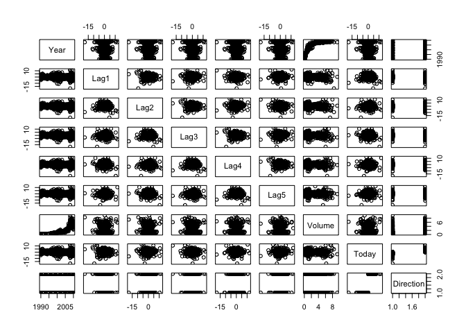

Homework 4
================
Zhan, Zhuoyi
Tue Feb 22 15:57:43 2022

Question 4.4

1.  On average, what fraction of the available observations will we use
    to make the prediction?

Becuase there is only 1 feature and it is uniformly distributed, so on
average we will use 10% of the obervation

2.  

1%

3.  

0.01^100 \*100 = 10^-98 %

4.  

The fraction of training data near test test observation decrease
exponentially.

5.  l = 0.1^(1/p) the volumn of hypercube’ will be 10% of the total
    volume of space in the p-dimension cube.

Question 4.10

1.  

``` r
#install.packages("ISLR")
library(ISLR)
summary(Weekly)
```

    ##       Year           Lag1               Lag2               Lag3         
    ##  Min.   :1990   Min.   :-18.1950   Min.   :-18.1950   Min.   :-18.1950  
    ##  1st Qu.:1995   1st Qu.: -1.1540   1st Qu.: -1.1540   1st Qu.: -1.1580  
    ##  Median :2000   Median :  0.2410   Median :  0.2410   Median :  0.2410  
    ##  Mean   :2000   Mean   :  0.1506   Mean   :  0.1511   Mean   :  0.1472  
    ##  3rd Qu.:2005   3rd Qu.:  1.4050   3rd Qu.:  1.4090   3rd Qu.:  1.4090  
    ##  Max.   :2010   Max.   : 12.0260   Max.   : 12.0260   Max.   : 12.0260  
    ##       Lag4               Lag5              Volume            Today         
    ##  Min.   :-18.1950   Min.   :-18.1950   Min.   :0.08747   Min.   :-18.1950  
    ##  1st Qu.: -1.1580   1st Qu.: -1.1660   1st Qu.:0.33202   1st Qu.: -1.1540  
    ##  Median :  0.2380   Median :  0.2340   Median :1.00268   Median :  0.2410  
    ##  Mean   :  0.1458   Mean   :  0.1399   Mean   :1.57462   Mean   :  0.1499  
    ##  3rd Qu.:  1.4090   3rd Qu.:  1.4050   3rd Qu.:2.05373   3rd Qu.:  1.4050  
    ##  Max.   : 12.0260   Max.   : 12.0260   Max.   :9.32821   Max.   : 12.0260  
    ##  Direction 
    ##  Down:484  
    ##  Up  :605  
    ##            
    ##            
    ##            
    ## 

``` r
pairs(Weekly)
```

<!-- --> Dimension
and year may have a curved, non-linear pattern. and direction has linear
pattern with other vriables.

2.  
