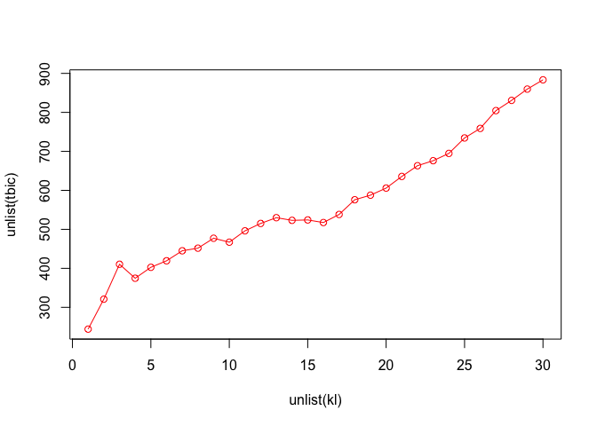
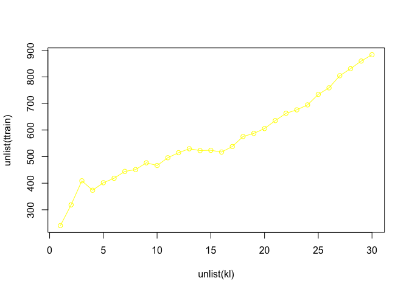
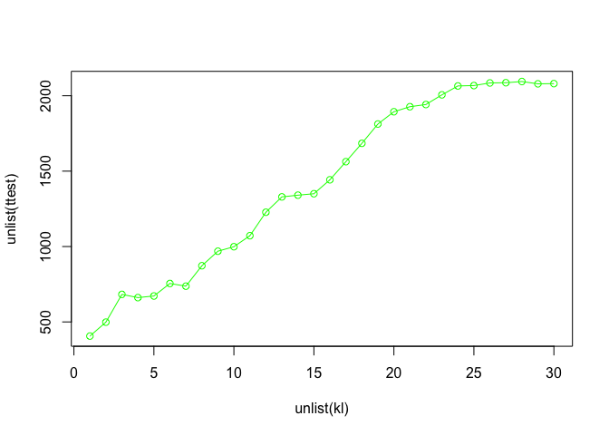

HW5-ZhanZ
================
Zhan, Zhuoyi
Thu Mar 17 14:51:56 2022

``` r
library('MASS') ## for 'mcycle'
library('manipulate') ## for 'manipulate'

data(mcycle)
```

## 1

Randomly split the mcycle data into training (75%) and validation (25%)
subsets.

``` r
library(caret)
```

    ## Loading required package: ggplot2

    ## Loading required package: lattice

``` r
index = createDataPartition(mcycle$accel, p = 0.75, list = FALSE)
train = mcycle[index, ]
test = mcycle[-index, ]
```

## 2

Using the mcycle data, consider predicting the mean acceleration as a
function of time. Use the Nadaraya-Watson method with the k-NN kernel
function to create a series of prediction models by varying the tuning
parameter over a sequence of values. (hint: the script already
implements this)

``` r
y <- mcycle$accel
x <- matrix(mcycle$times, length(mcycle$times), 1)

plot(x, y, xlab="Time (ms)", ylab="Acceleration (g)")
```

<!-- -->

``` r
## Epanechnikov kernel function
## x  - n x p matrix of training inputs
## x0 - 1 x p input where to make prediction
## lambda - bandwidth (neighborhood size)
kernel_epanechnikov <- function(x, x0, lambda=1) {
  d <- function(t)
    ifelse(t <= 1, 3/4*(1-t^2), 0)
  z <- t(t(x) - x0)
  d(sqrt(rowSums(z*z))/lambda)
}

## k-NN kernel function
## x  - n x p matrix of training inputs
## x0 - 1 x p input where to make prediction
## k  - number of nearest neighbors
kernel_k_nearest_neighbors <- function(x, x0, k=1) {
  ## compute distance betwen each x and x0
  z <- t(t(x) - x0)
  d <- sqrt(rowSums(z*z))

  ## initialize kernel weights to zero
  w <- rep(0, length(d))
  
  ## set weight to 1 for k nearest neighbors
  w[order(d)[1:k]] <- 1
  
  return(w)
}

## Make predictions using the NW method
## y  - n x 1 vector of training outputs
## x  - n x p matrix of training inputs
## x0 - m x p matrix where to make predictions
## kern  - kernel function to use
## ... - arguments to pass to kernel function
nadaraya_watson <- function(y, x, x0, kern, ...) {
  k <- t(apply(x0, 1, function(x0_) {
    k_ <- kern(x, x0_, ...)
    k_/sum(k_)
  }))
  yhat <- drop(k %*% y)
  attr(yhat, 'k') <- k
  return(yhat)
}
```

``` r
## Helper function to view kernel (smoother) matrix
matrix_image <- function(x) {
  rot <- function(x) t(apply(x, 2, rev))
  cls <- rev(gray.colors(20, end=1))
  image(rot(x), col=cls, axes=FALSE)
  xlb <- pretty(1:ncol(x))
  xat <- (xlb-0.5)/ncol(x)
  ylb <- pretty(1:nrow(x))
  yat <- (ylb-0.5)/nrow(x)
  axis(3, at=xat, labels=xlb)
  axis(2, at=yat, labels=ylb)
  mtext('Rows', 2, 3)
  mtext('Columns', 3, 3)
}

## Compute effective df using NW method
## y  - n x 1 vector of training outputs
## x  - n x p matrix of training inputs
## kern  - kernel function to use
## ... - arguments to pass to kernel function
effective_df <- function(y, x, kern, ...) {
  y_hat <- nadaraya_watson(y, x, x,
    kern=kern, ...)
  sum(diag(attr(y_hat, 'k')))
}

## loss function
## y    - train/test y
## yhat - predictions at train/test x
loss_squared_error <- function(y, yhat)
  (y - yhat)^2

## test/train error
## y    - train/test y
## yhat - predictions at train/test x
## loss - loss function
error <- function(y, yhat, loss=loss_squared_error)
  mean(loss(y, yhat))

## AIC
## y    - training y
## yhat - predictions at training x
## d    - effective degrees of freedom
aic <- function(y, yhat, d)
  error(y, yhat) + 2/length(y)*d

## BIC
## y    - training y
## yhat - predictions at training x
## d    - effective degrees of freedom
bic <- function(y, yhat, d)
  error(y, yhat) + log(length(y))/length(y)*d


## make predictions using NW method at training inputs
y_hat <- nadaraya_watson(y, x, x,
  kernel_epanechnikov, lambda=5)

## view kernel (smoother) matrix
matrix_image(attr(y_hat, 'k'))
```

<!-- -->

``` r
## compute effective degrees of freedom
edf <- effective_df(y, x, kernel_epanechnikov, lambda=5)
aic(y, y_hat, edf)
```

    ## [1] 677.1742

``` r
bic(y, y_hat, edf)
```

    ## [1] 677.3629

``` r
## create a grid of inputs 
x_plot <- matrix(seq(min(x),max(x),length.out=100),100,1)

## make predictions using NW method at each of grid points
y_hat_plot <- nadaraya_watson(y, x, x_plot,
  kernel_epanechnikov, lambda=1)

## plot predictions
plot(x, y, xlab="Time (ms)", ylab="Acceleration (g)")
lines(x_plot, y_hat_plot, col="#882255", lwd=2) 
```

<!-- -->

## 3

With the squared-error loss function, compute and plot the training
error, AIC, BIC, and validation error (using the validation data) as
functions of the tuning parameter.

``` r
x_train = matrix(train$times, length(train$times), 1)
y_train = train$accel
x_test = matrix(test$times, length(test$times), 1)
y_test = test$accel
y_hat <- nadaraya_watson(y_train, x_train, x_train,
  kernel_epanechnikov, lambda=5)

## k-NN kernel function
## x  - n x p matrix of training inputs
## x0 - 1 x p input where to make prediction
## k  - number of nearest neighbors
kernel_k_nearest_neighbors <- function(x, x0, k) {
  ## compute distance betwen each x and x0
  z <- t(t(x) - x0)
  d <- sqrt(rowSums(z*z))

  ## initialize kernel weights to zero
  w <- rep(0, length(d))
  
  ## set weight to 1 for k nearest neighbors
  w[order(d)[1:k]] <- 1
  
  return(w)
}
## loss function
## y    - train/test y
## yhat - predictions at train/test x
loss_squared_error <- function(y, yhat)
  (y - yhat)^2

## test/train error
## y    - train/test y
## yhat - predictions at train/test x
## loss - loss function
error <- function(y, yhat, loss=loss_squared_error)
  mean(loss(y, yhat))
## AIC
## y    - training y
## yhat - predictions at training x
## d    - effective degrees of freedom
aic <- function(y, yhat, d)
  error(y, yhat) + 2/length(y)*d

## BIC
## y    - training y
## yhat - predictions at training x
## d    - effective degrees of freedom
bic <- function(y, yhat, d)
  error(y, yhat) + log(length(y))/length(y)*d

plot
```

    ## function (x, y, ...) 
    ## UseMethod("plot")
    ## <bytecode: 0x7ff3fe3669b0>
    ## <environment: namespace:base>

``` r
x_train = matrix(train$times, length(train$times), 1)
y_train = train$accel
x_test = matrix(test$times, length(test$times), 1)
y_test = test$accel
#y_hat <- nadaraya_watson(y_train, x_train, x_train,
#  kernel_epanechnikov, lambda=5)

taic=list()
tbic=list()
ttrain=list()
ttest = list()
kl = list()
## how does k affect shape of predictor and eff. df using k-nn kernel ?
for (k in 1:30) {
   ## make predictions using NW method at training inputs
  print(k)
   y_hat <- nadaraya_watson(y_train, x_train, x_train,
     kern=kernel_k_nearest_neighbors, k=k)
   y_hat2 <- nadaraya_watson(y_test, x_test, x_test,
     kern=kernel_k_nearest_neighbors, k=k)
   edf <- effective_df(y_train, x_train, 
     kern=kernel_k_nearest_neighbors, k=k)
   aic_ <- aic(y_train, y_hat, edf)
   bic_ <- bic(y_train, y_hat, edf)
   train_err  <- error(y_train, y_hat)
   test_err <- error(y_test, y_hat2)
   taic<-append(taic, aic_)
   tbic<-append(tbic,bic_)
   ttrain<-append(ttrain, train_err)
   ttest<-append(ttest,test_err)
   kl<- append(kl,k)
}
```

    ## [1] 1
    ## [1] 2
    ## [1] 3
    ## [1] 4
    ## [1] 5
    ## [1] 6
    ## [1] 7
    ## [1] 8
    ## [1] 9
    ## [1] 10
    ## [1] 11
    ## [1] 12
    ## [1] 13
    ## [1] 14
    ## [1] 15
    ## [1] 16
    ## [1] 17
    ## [1] 18
    ## [1] 19
    ## [1] 20
    ## [1] 21
    ## [1] 22
    ## [1] 23
    ## [1] 24
    ## [1] 25
    ## [1] 26
    ## [1] 27
    ## [1] 28
    ## [1] 29
    ## [1] 30

``` r
plot(unlist(kl),unlist(taic),type='o',xlab="k",ylab="Error rate",col="blue")
```

<!-- -->

``` r
plot(unlist(kl),unlist(tbic),type='o',col="red")
```

<!-- -->

``` r
plot(unlist(kl),unlist(ttrain),type='o',col="yellow")
```

<!-- -->

``` r
plot(unlist(kl),unlist(ttest),type='o',col="green")
```

<!-- -->

``` r
set.seed(42)
#clean.data <- mcycle[complete.cases(mcycle),]
resample_rows <-  sample(nrow(mcycle))
resample_dat <- mcycle[resample_rows, ]
# Dividing the data into 5 equal parts
n <-  ceiling(nrow(mcycle)/5)


#splitting the data into 5 parts
df_1 <- resample_dat[1:27, ]
df_2 <- resample_dat[28:54, ]
df_3 <- resample_dat[55:81, ]
df_4 <- resample_dat[82:108, ]
df_5 <- resample_dat[109:133, ]
cross_val_dat <- list(df_1 , df_2, df_3, df_4, df_5)

#choose 50 tuning parameters to fit using CV

num_tuned = 50
#test = rep(0, 50)
#train = rep(0, 50)
err_cv <- matrix(0, nrow = num_tuned, ncol=5)

for(i in 1:num_tuned){
  for(j in 1:5){
    test <- cross_val_dat[[j]]
    train <- resample_dat[ setdiff(rownames(resample_dat),rownames(cross_val_dat[[j]])) , ]
    pred <- nadaraya_watson(y=train[,2], 
                            x = as.matrix(train[,1]), 
                            x0 = as.matrix(test[,1]), 
                            kern = kernel_k_nearest_neighbors, 
                            k=i)
    
    #err_cv[i, j] <- 1
    err_cv[i, j] <- error(y=test[,2], yhat = pred, loss=loss_squared_error)
  }
}
```

``` r
average_error <- apply(err_cv, 1, mean)
stds <- apply(err_cv, 1, sd)
plot(x=1:num_tuned, y = average_error, type="l", col="red", pch=20, xlab = "k", ylab = "Average CV error", main=" CV-estimated test error")
segments(x0=1:50, y0 = average_error - stds, y1= average_error+stds, lty =2)
points(x=1:num_tuned, y = average_error, pch=20, col="blue", cex=.5)

abline(h=(average_error+stds)[which.min(average_error)],lty=2,col ="black")
```

<!-- -->

## Interpret the resulting figures and select a suitable value for the tuning parameter.

### The test error first decrease and then increase as the tuning parameter, k (number of neighbors) increases. According to the one standard error rule, At k=8, the model has the lowest averaged test error. K =21 is the most parsimonious model whode error is no more than one standard error above the error of the best model.
