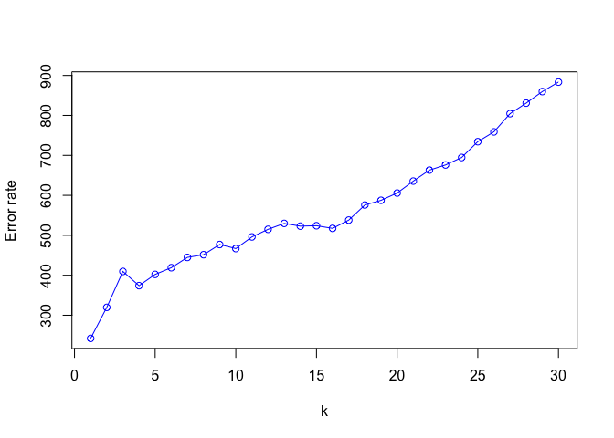

HW5-ZhanZ
================
Zhan, Zhuoyi
Thu Mar 3 20:21:54 2022

``` r
library('MASS') ## for 'mcycle'
library('manipulate') ## for 'manipulate'

data(mcycle)
```

Randomly split the mcycle data into training (75%) and validation (25%)
subsets.

``` r
library(caret)
```

    ## Loading required package: ggplot2

    ## Loading required package: lattice

``` r
index = createDataPartition(mcycle$accel, p = 0.75, list = FALSE)
train = mcycle[index, ]
test = mcycle[-index, ]
```

Using the mcycle data, consider predicting the mean acceleration as a
function of time. Use the Nadaraya-Watson method with the k-NN kernel
function to create a series of prediction models by varying the tuning
parameter over a sequence of values. (hint: the script already
implements this)

``` r
kernel_epanechnikov <- function(x, x0, lambda=1) {
  d <- function(t)
    ifelse(t <= 1, 3/4*(1-t^2), 0)
  z <- t(t(x) - x0)
  d(sqrt(rowSums(z*z))/lambda)
}
kernel_k_nearest_neighbors <- function(x, x0, k=1) {
  ## compute distance betwen each x and x0
  z <- t(t(x) - x0)
  d <- sqrt(rowSums(z*z))

  ## initialize kernel weights to zero
  w <- rep(0, length(d))
  
  ## set weight to 1 for k nearest neighbors
  w[order(d)[1:k]] <- 1
  
  return(w)
}

nadaraya_watson <- function(y, x, x0, kern, ...) {
  k <- t(apply(x0, 1, function(x0_) {
    k_ <- kern(x, x0_, ...)
    k_/sum(k_)
  }))
  yhat <- drop(k %*% y)
  attr(yhat, 'k') <- k
  return(yhat)
}
```

``` r
x_train = matrix(train$times, length(train$times), 1)
y_train = train$accel
x_test = matrix(test$times, length(test$times), 1)
y_test = test$accel

y_hat <- nadaraya_watson(y_train, x_train, x_train,
  kernel_epanechnikov, lambda=5)
```

``` r
## Helper function to view kernel (smoother) matrix
matrix_image <- function(x) {
  rot <- function(x) t(apply(x, 2, rev))
  cls <- rev(gray.colors(20, end=1))
  image(rot(x), col=cls, axes=FALSE)
  xlb <- pretty(1:ncol(x))
  xat <- (xlb-0.5)/ncol(x)
  ylb <- pretty(1:nrow(x))
  yat <- (ylb-0.5)/nrow(x)
  axis(3, at=xat, labels=xlb)
  axis(2, at=yat, labels=ylb)
  mtext('Rows', 2, 3)
  mtext('Columns', 3, 3)
}

## Compute effective df using NW method
## y  - n x 1 vector of training outputs
## x  - n x p matrix of training inputs
## kern  - kernel function to use
## ... - arguments to pass to kernel function
effective_df <- function(y, x, kern, ...) {
  y_hat <- nadaraya_watson(y, x, x,
    kern=kern, ...)
  sum(diag(attr(y_hat, 'k')))
}
```

With the squared-error loss function, compute and plot the training
error, AIC, BIC, and validation error (using the validation data) as
functions of the tuning parameter.

``` r
## loss function
## y    - train/test y
## yhat - predictions at train/test x
loss_squared_error <- function(y, yhat)
  (y - yhat)^2

## test/train error
## y    - train/test y
## yhat - predictions at train/test x
## loss - loss function
error <- function(y, yhat, loss=loss_squared_error)
  mean(loss(y, yhat))

## AIC
## y    - training y
## yhat - predictions at training x
## d    - effective degrees of freedom
aic <- function(y, yhat, d)
  error(y, yhat) + 2/length(y)*d

## BIC
## y    - training y
## yhat - predictions at training x
## d    - effective degrees of freedom
bic <- function(y, yhat, d)
  error(y, yhat) + log(length(y))/length(y)*d


## make predictions using NW method at training inputs
y_hat <- nadaraya_watson(y_train, x_train, x_train,
  kernel_epanechnikov, lambda=5)

## view kernel (smoother) matrix
matrix_image(attr(y_hat, 'k'))
```

<!-- -->

``` r
## compute effective degrees of freedom
edf <- effective_df(y_train, x_train, kernel_epanechnikov, lambda=5)
aic(y_train, y_hat, edf)
```

    ## [1] 732.7138

``` r
bic(y_train, y_hat, edf)
```

    ## [1] 732.9292

``` r
## create a grid of inputs 
x_plot <- matrix(seq(min(x_train),max(x_train),length.out=100),100,1)

## make predictions using NW method at each of grid points
y_hat_plot <- nadaraya_watson(y_train, x_train, x_plot,
  kernel_epanechnikov, lambda=1)

## plot predictions
plot(x_train, y_train, xlab="Time (ms)", ylab="Acceleration (g)")
lines(x_plot, y_hat_plot, col="#882255", lwd=2) 
```

<!-- -->

``` r
## how does k affect shape of predictor and eff. df using k-nn kernel ?
# manipulate({
#   ## make predictions using NW method at training inputs
#   y_hat <- nadaraya_watson(y, x, x,
#     kern=kernel_k_nearest_neighbors, k=k_slider)
#   edf <- effective_df(y, x, 
#     kern=kernel_k_nearest_neighbors, k=k_slider)
#   aic_ <- aic(y, y_hat, edf)
#   bic_ <- bic(y, y_hat, edf)
#   y_hat_plot <- nadaraya_watson(y, x, x_plot,
#     kern=kernel_k_nearest_neighbors, k=k_slider)
#   plot(x, y, xlab="Time (ms)", ylab="Acceleration (g)")
#   legend('topright', legend = c(
#     paste0('eff. df = ', round(edf,1)),
#     paste0('aic = ', round(aic_, 1)),
#     paste0('bic = ', round(bic_, 1))),
#     bty='n')
#   lines(x_plot, y_hat_plot, col="#882255", lwd=2) 
# }, k_slider=slider(1, 10, initial=3, step=1))
```
