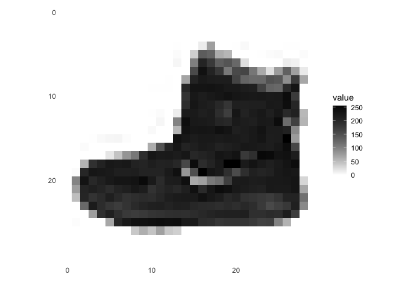
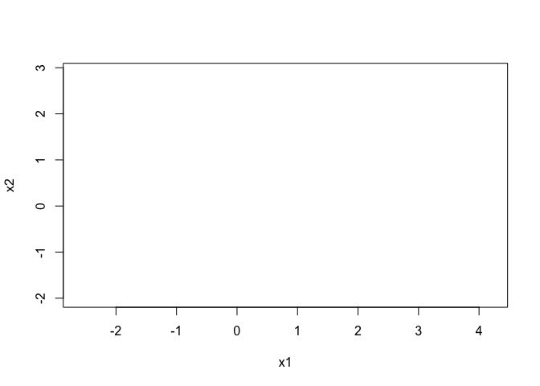
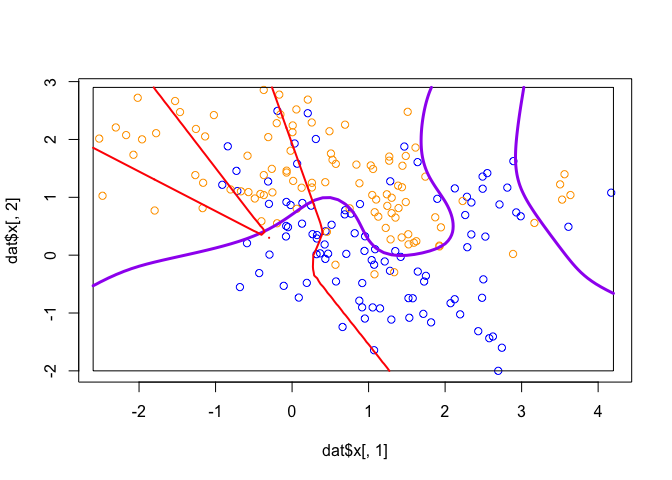
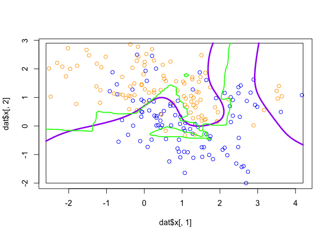

HW7-ZhanZ
================
Zhan, Zhuoyi
Sat Apr 30 16:23:37 2022

``` r
library(keras)
```

    ## Warning: package 'keras' was built under R version 4.1.2

``` r
fashion_mnist <- dataset_fashion_mnist()
```

    ## Loaded Tensorflow version 2.8.0

``` r
c(train_images, train_labels) %<-% fashion_mnist$train
c(test_images, test_labels) %<-% fashion_mnist$test
```

``` r
library(tidyr)
library(ggplot2)

image_1 <- as.data.frame(train_images[1, , ])
colnames(image_1) <- seq_len(ncol(image_1))
image_1$y <- seq_len(nrow(image_1))
image_1 <- gather(image_1, "x", "value", -y)
image_1$x <- as.integer(image_1$x)

ggplot(image_1, aes(x = x, y = y, fill = value)) +
  geom_tile() +
  scale_fill_gradient(low = "white", high = "black", na.value = NA) +
  scale_y_reverse() +
  theme_minimal() +
  theme(panel.grid = element_blank())   +
  theme(aspect.ratio = 1) +
  xlab("") +
  ylab("")
```

<!-- -->

``` r
class_names = c('T-shirt/top',
                'Trouser',
                'Pullover',
                'Dress',
                'Coat', 
                'Sandal',
                'Shirt',
                'Sneaker',
                'Bag',
                'Ankle boot')
```

``` r
train_images <- train_images / 255
test_images <- test_images / 255
par(mfcol=c(5,5))
par(mar=c(0, 0, 1.5, 0), xaxs='i', yaxs='i')
for (i in 1:25) { 
  img <- train_images[i, , ]
  img <- t(apply(img, 2, rev)) 
  image(1:28, 1:28, img, col = gray((0:255)/255), xaxt = 'n', yaxt = 'n',
        main = paste(class_names[train_labels[i] + 1]))
}
```

<!-- -->

``` r
model <- keras_model_sequential()
model %>%
  layer_flatten(input_shape = c(28, 28)) %>%
  layer_dense(units = 128, activation = 'relu') %>%
  layer_dense(units = 10, activation = 'softmax')
```

``` r
model %>% compile(
  optimizer = 'adam', 
  loss = 'sparse_categorical_crossentropy',
  metrics = c('accuracy')
)
```

``` r
model %>% fit(train_images, train_labels, epochs = 5, verbose = 2)
score <- model %>% evaluate(test_images, test_labels, verbose = 0)

cat('Test loss:', score['loss'], "\n")
```

    ## Test loss: 0.341453

``` r
cat('Test accuracy:', score['accuracy'], "\n")
```

    ## Test accuracy: 0.88

``` r
predictions <- model %>% predict(test_images)

# check
predictions[1, ]
```

    ##  [1] 1.736555e-07 6.159686e-08 8.113609e-07 3.275220e-07 9.097581e-07
    ##  [6] 5.029147e-03 1.746648e-06 6.600983e-02 5.044081e-05 9.289065e-01

``` r
which.max(predictions[1, ])
```

    ## [1] 10

``` r
class_pred <- model %>% predict(test_images) %>% k_argmax()
class_pred[1:20]
```

    ## tf.Tensor([9 2 1 1 6 1 4 6 5 7 4 5 7 3 4 1 2 2 8 0], shape=(20), dtype=int64)

``` r
test_labels[1]
```

    ## [1] 9

``` r
# see some prediction. correct: green, wrong: red
par(mfcol=c(5,5))
par(mar=c(0, 0, 1.5, 0), xaxs='i', yaxs='i')
for (i in 1:25) { 
  img <- test_images[i, , ]
  img <- t(apply(img, 2, rev)) 
  # subtract 1 as labels go from 0 to 9
  predicted_label <- which.max(predictions[i, ]) - 1
  true_label <- test_labels[i]
  if (predicted_label == true_label) {
    color <- '#008800' 
  } else {
    color <- '#bb0000'
  }
  image(1:28, 1:28, img, col = gray((0:255)/255), xaxt = 'n', yaxt = 'n',
        main = paste0(class_names[predicted_label + 1], " (",
                      class_names[true_label + 1], ")"),
        col.main = color)
}
```

<!-- -->

``` r
## predict single image
# Grab an image from the test dataset
# take care to keep the batch dimension, as this is expected by the model
img <- test_images[1, , , drop = FALSE]
dim(img)
```

    ## [1]  1 28 28

``` r
predictions <- model %>% predict(img)
predictions
```

    ##              [,1]         [,2]         [,3]         [,4]         [,5]
    ## [1,] 1.736556e-07 6.159652e-08 8.113579e-07 3.275214e-07 9.097546e-07
    ##             [,6]         [,7]       [,8]         [,9]     [,10]
    ## [1,] 0.005029136 1.746645e-06 0.06600969 5.044071e-05 0.9289066

``` r
# subtract 1 as labels are 0-based
prediction <- predictions[1, ] - 1
which.max(prediction)
```

    ## [1] 10

``` r
class_pred <- model %>% predict(img) %>% k_argmax()
class_pred
```

    ## tf.Tensor([9], shape=(1), dtype=int64)

Use the Keras library to re-implement the simple neural network
discussed during lecture for the mixture data (see nnet.R). Use a single
10-node hidden layer; fully connected.

``` r
#install.packages('rgl')
library('rgl')
library('nnet')
library('dplyr')
```

    ## 
    ## Attaching package: 'dplyr'

    ## The following objects are masked from 'package:stats':
    ## 
    ##     filter, lag

    ## The following objects are masked from 'package:base':
    ## 
    ##     intersect, setdiff, setequal, union

``` r
library('ElemStatLearn')
data(mixture.example)
```

``` r
dat <- mixture.example
```

``` r
model <- keras_model_sequential()
model %>%
  layer_dense(units = 10, activation = 'relu') %>%
  layer_dense(units = 2, activation = 'softmax')
```

``` r
model %>% compile(
  optimizer = 'adam', 
  loss = 'sparse_categorical_crossentropy',
  metrics = c('accuracy')
)
```

``` r
model %>% fit(x=dat$x, y=dat$y, epochs = 5, verbose = 2)
```

## 3.

``` r
plot_mixture_data <- expression({
  plot(dat$xnew[,1], dat$xnew[,2], type="n",xlab="x1", ylab="x2")
  ## plot points and bounding box
  x1r <- range(dat$px1)
  x2r <- range(dat$px2)
  pts <- plot(dat$x[,1], dat$x[,2],
                type="p",col=ifelse(dat$y, "orange", "blue"))
  lns <- lines(x1r[c(1,2,2,1,1)], x2r[c(1,1,2,2,1)])

  prob <- matrix(dat$prob, length(dat$px1), length(dat$px2))
  cls <- contourLines(dat$px1, dat$px2,prob, levels=0.5)
  pls <- lapply(cls, function(p) 
    lines(p$x, p$y, col='purple', lwd=3))
})
```

``` r
plot_keras_predictions <- function(fit, dat=mixture.example) {
  
  ## create figure
  eval(plot_mixture_data)
  
  ## compute predictions from nnet
  preds <- predict(fit, dat$xnew, type="class")
  probs <- predict(fit, dat$xnew, type="raw")[,1]
  probm <- matrix(probs, length(dat$px1), length(dat$px2))
  cls <- contourLines(dat$px1, dat$px2, probm, levels=0.5)
  
  ## plot classification boundary
  pls <- lapply(cls, function(p) 
    lines(p$x, p$y,col='red', lwd=2))
}

plot_keras_predictions(model)
```

<!-- --><!-- -->

``` r
plot_nnet_predictions <- function(fit, dat=mixture.example) {
  
  ## create figure
  eval(plot_mixture_data)
  
  ## compute predictions from nnet
  preds <- predict(fit, dat$xnew, type="class")
  probs <- predict(fit, dat$xnew, type="raw")[,1]
  probm <- matrix(probs, length(dat$px1), length(dat$px2))
  cls <- contourLines(dat$px1, dat$px2, probm, levels=0.5)
  
  ## plot classification boundary
  pls <- lapply(cls, function(p) 
    lines(p$x, p$y, z=1, col='green', lwd=2))
}

nnet_fit <- nnet(x=dat$x, y=dat$y, size=10, entropy=TRUE, decay=0) 
```

    ## # weights:  41
    ## initial  value 158.345161 
    ## iter  10 value 97.757240
    ## iter  20 value 87.772668
    ## iter  30 value 80.088912
    ## iter  40 value 75.637186
    ## iter  50 value 65.966804
    ## iter  60 value 56.732687
    ## iter  70 value 55.442612
    ## iter  80 value 55.086658
    ## iter  90 value 54.912006
    ## iter 100 value 54.559244
    ## final  value 54.559244 
    ## stopped after 100 iterations

``` r
plot_nnet_predictions(nnet_fit)
```

<!-- -->

    ## Warning in plot.xy(xy.coords(x, y), type = type, ...): "z" is not a graphical
    ## parameter

    ## Warning in plot.xy(xy.coords(x, y), type = type, ...): "z" is not a graphical
    ## parameter

    ## Warning in plot.xy(xy.coords(x, y), type = type, ...): "z" is not a graphical
    ## parameter

<!-- -->
